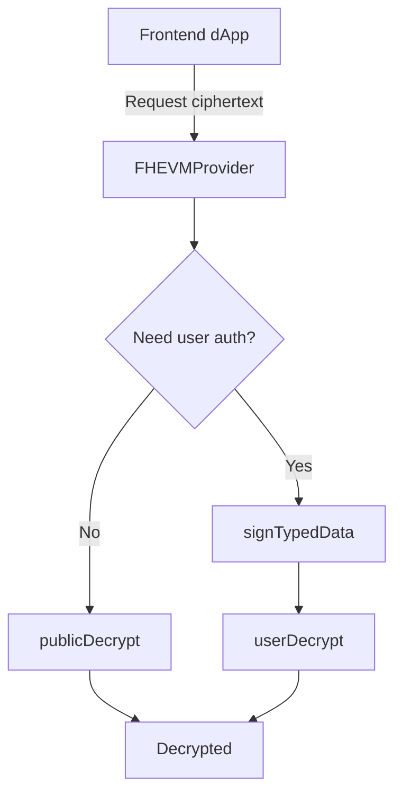

# 🌐 Universal FHEVM SDK (Monorepo) / 通用 FHEVM SDK（多包结构）

> **One-line intro / 一句话简介**
> A **framework-agnostic and pluggable FHEVM SDK stack**, offering minimal initialization, encryption & decryption capabilities, plus a React “wagmi-like” adapter and Next.js demo.
> 一个**框架无关、可插拔适配层**的 FHEVM SDK 栈，提供最小可用的初始化 / 加密 / 解密功能，并包含 React “wagmi 式”适配层与 Next.js 演示应用。

---

### 🌍 Live Demo

✅ **HTTPS Online Version（Vercel / Docker）**
👉 [http://65.21.128.40:3000](http://65.21.128.40:3000)

### 🎬 Demo Video

🎥 [Loom Walkthrough (3–5 min)](https://www.loom.com/share/097214bec74f4048be40e7d01b940137?sid=4dcf3270-bd37-490e-a8f6-bff3282a047d)

### 💠 Example Contract

🧾 **Sepolia Testnet:** `0x9F8069282814a1177C1f6b8D7d8f7cC11A663554`

---

## 📚 Table of Contents / 目录

* [Project Structure 项目结构](#project-structure--项目结构)
* [Architecture 架构图](#architecture--架构图)
* [Features 功能特性](#features--功能特性)
* [Quick Start 快速开始](#quick-start--快速开始)
* [Environment Variables 环境变量](#environment-variables--环境变量)
* [Scripts 脚本命令](#scripts--脚本命令)
* [Core API 核心API](#core-api--核心api)
* [React Adapter 适配层](#react-adapter--适配层)
* [EIP-712 Read-Permit Flow 授权解密流程](#eip-712-read-permit-flow--授权解密流程)
* [Next.js Example 示例](#nextjs-example--示例)
* [Testing 测试](#testing--测试)
* [Deployment 部署](#deployment--部署)
* [FAQ & Troubleshooting 常见问题](#faq--troubleshooting--常见问题)
* [Changelog 变更记录](#changelog--变更记录)
* [License 许可证](#license--许可证)

---

## 🧩 Project Structure / 项目结构

```text
universal-fhevm-sdk/
├─ packages/
│  ├─ fhevm-sdk-core/      # Core TypeScript SDK, framework-agnostic / 核心库
│  ├─ fhevm-sdk-react/     # React adapter with hooks / React 适配层
│  └─ (optional adapters)  # ethers/viem/vue/node 等其他适配
├─ examples/
│  └─ nextjs-demo/         # Next.js showcase / 演示应用
├─ scripts/                # Dev & CI utilities / 开发脚本
└─ package.json            # pnpm workspace root / 工作区根
```

📦 **Monorepo via `pnpm` workspaces**
根目录定义 `"workspaces": ["packages/*", "examples/*"]`。

---

## 🧠 Architecture / 架构图

```
   +-----------------------------+
   |   dApps (React/Vue/Node)    |
   +-------------+---------------+
                 ↓
         +---------------+
         | fhevm-sdk-react|
         | - Provider     |
         | - useFHEVM()   |
         | - useEncrypt() |
         | - useDecrypt() |
         +-------+-------+
                 ↓
         +---------------+
         | fhevm-sdk-core |
         | - createFHEVM  |
         | - encryptUint32|
         | - userDecrypt  |
         | - publicDecrypt|
         +-------+-------+
                 ↓
         +---------------+
         |  Adapters      |
         | (viem/ethers)  |
         +---------------+
```

🧩 **设计要点 / Key Design Principles**

* 核心 SDK **不依赖框架**；
* 通过 adapter 兼容多前端；
* EIP-712 授权解密；
* 支持可插拔链交互实现。

---

## ⚙️ Features / 功能特性

| 功能                               | 描述                                             |
| -------------------------------- | ---------------------------------------------- |
| `createFHEVM`                    | 初始化 FHEVM 上下文（RPC、ChainID、Adapter）             |
| `encryptUint32` / `encryptBytes` | 前端加密明文为密文（proof+input）                         |
| `userDecrypt`                    | 基于 EIP-712 的用户授权解密                             |
| `publicDecrypt`                  | 无签名公共解密路径                                      |
| React Hooks                      | `useFHEVM`、`useEncryptedWrite`、`useDecryption` |
| Next.js Demo                     | 一键演示连接钱包、加密写入、解密读取                             |

---

## 🚀 Quick Start / 快速开始（≤ 10 行命令）

```bash
git clone https://github.com/optimus-a1/fhevm-react-template.git universal-fhevm-sdk
cd universal-fhevm-sdk
pnpm install
pnpm build
pnpm --filter nextjs-demo dev
# 打开 http://localhost:3000 或部署地址
```

💡 *Fork from the official Zama template before submission.*

---

## 🔑 Environment Variables / 环境变量

`.env.local`:

```bash
NEXT_PUBLIC_RPC_URL=https://rpc.sepolia.org
NEXT_PUBLIC_CONTRACT_ADDRESS=0x9F8069282814a1177C1f6b8D7d8f7cC11A663554
```

在 Vercel 部署时，进入
**Project → Settings → Environment Variables**
设置相同变量即可。

---

## 🧰 Scripts / 脚本命令

```json
{
  "scripts": {
    "bootstrap": "pnpm install",
    "build": "pnpm -r build",
    "demo:next": "pnpm --filter nextjs-demo dev",
    "contract:deploy": "hardhat run scripts/deploy.ts --network sepolia"
  }
}
```

---

## 🧩 Core API / 核心 API（`fhevm-sdk-core`）

```ts
const fhevm = await createFHEVM({ chainId: 11155111, rpcUrl });
const { input, proof } = await fhevm.encryptUint32(42);
const result = await fhevm.userDecrypt({ account, payload });
```

---

## ⚛️ React Adapter / React 适配层

```tsx
<FHEVMProvider config={{ chainId: 11155111, rpcUrl: process.env.NEXT_PUBLIC_RPC_URL! }}>
  <App />
</FHEVMProvider>

const { fhevm, ready } = useFHEVM();
const { write } = useEncryptedWrite({ contract, functionName, args });
```

---

## 🔏 EIP-712 Read-Permit Flow / 授权解密流程



💡 确保 `domain.chainId` 与合约一致，否则签名失败。

---

## 🧪 Testing / 测试

```bash
pnpm --filter fhevm-sdk-core test
```

建议用例：

* `encryptUint32` 输出类型；
* `userDecrypt` 模拟签名；
* 可选端到端测试：写密文 → 解密。

---

## 🌐 Deployment / 部署（Docker / Vercel）

### 🐳 Docker

```bash
docker build -t fhevm-app .
docker run -d -p 3000:3000 fhevm-app
```

→ 打开 [http://65.21.128.40:3000](http://65.21.128.40:3000)

### ▲ Vercel

1. Fork 并导入到 Vercel
2. 设置环境变量
3. 点击 **Deploy**

---

## 🧭 FAQ & Troubleshooting / 常见问题

| 问题         | 解决方案                           |
| ---------- | ------------------------------ |
| 钱包未注入      | 使用 HTTPS 或 localhost           |
| EIP-712 失败 | 检查 `domain.name/chainId/types` |
| 连接失败       | 重新初始化 SDK 或刷新 RPC              |
| Fork 检查失败  | 保持 upstream 关联                 |

---

## 🧾 Changelog / 变更记录

| 版本         | 内容                                               |
| ---------- | ------------------------------------------------ |
| **v0.1.0** | 初始化 Monorepo，构建 core/react/next 示例，支持 EIP-712 解密 |

---

## 📜 License / 许可证

MIT License © 2025 optimus-a1

---


